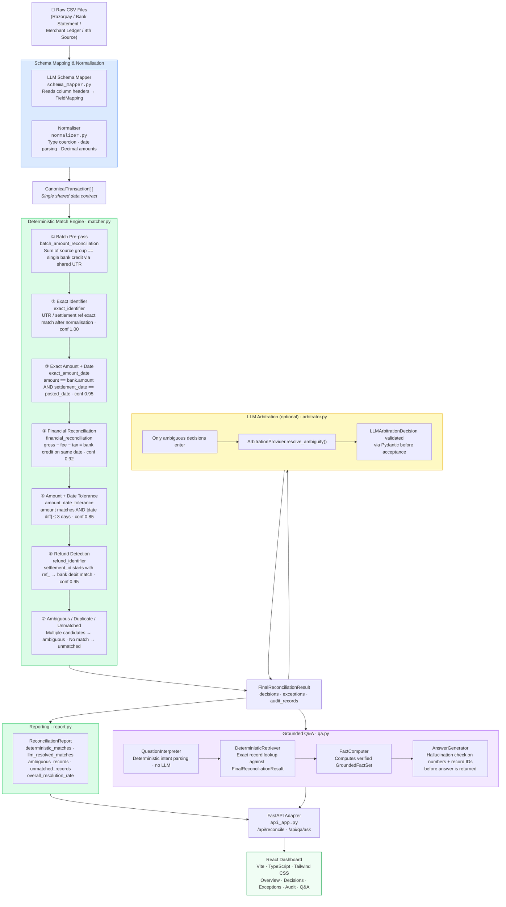

# Architecture — Razorpay AI Finance Controller

This document describes the system's data flow, service boundaries, and the deliberate design choices that keep LLM involvement bounded and auditable.

---

## High-Level Data Flow

**Colour key:**
| Colour | Responsibility |
|---|---|
| 🔵 Blue | LLM-assisted (schema mapping only) |
| 🟢 Green | Fully deterministic |
| 🟡 Yellow | LLM-optional (arbitration, bounded by Pydantic contract) |
| 🟣 Purple | Grounded Q&A (deterministic retrieval; LLM optional for answer phrasing) |

---

## Service Responsibilities

### `schema_mapper.py` — Schema Mapping
The only stage where an LLM is **always** consulted. It receives a list of column headers from the uploaded CSV and returns a `FieldMapping` dictionary that maps columns to the canonical field names (`amount`, `reference`, `settlement_date`, etc.). The output is a pure data structure — the LLM makes no reconciliation decisions.

### `normalizer.py` — Normalisation
Converts raw row dictionaries into `CanonicalTransaction` Pydantic models. Handles type coercion (string → `Decimal`, string → `date`), UTR normalisation, and source tagging. **No LLM involvement.**

### `matcher.py` — Deterministic Match Engine
The heart of the system. Runs **6 matching methods** in strict priority order. Each method produces a `ReconciliationDecision` (matched / ambiguous / unmatched), an `AuditRecord`, and optionally an `ExceptionRecord`. Bank records consumed by a match are removed from the available pool, preventing double-matching.

| # | Method | When it fires | Confidence |
|---|---|---|---|
| Pre-pass | `batch_amount_reconciliation` | ≥2 source records share a UTR; their sum equals one bank credit | 0.90 |
| 1 | `exact_identifier` | UTR/reference string match after normalisation | 1.00 |
| 2 | `exact_amount_date` | amount equal AND `settlement_date == posted_date` | 0.95 |
| 3 | `financial_reconciliation` | `gross − fee − tax == bank_credit` on same date | 0.92 |
| 4 | `amount_date_tolerance` | amount equal AND \|date diff\| ≤ 3 days | 0.85 |
| 5 | `refund_identifier` | `settlement_id` starts with `ref_`; bank debit matches gross | 0.95 |
| Fallback | `ambiguous` / `duplicate` / `unmatched` | Multiple candidates / duplicate bank IDs / no match | 0.40 / 0.40 / 0.10 |

### `arbitrator.py` — LLM Arbitration Service
Receives only records that left the deterministic engine as `ambiguous`. The LLM provider's raw output is validated against a `LLMArbitrationDecision` Pydantic model before any field on the decision is updated. If validation fails, the original `ambiguous` decision is preserved. The candidate ID returned by the LLM is also checked against the original candidate pool — hallucinated IDs are rejected.

### `reconciliation.py` — Pipeline Orchestrator
The public API surface: `reconcile(source_records, target_records, arbitrator=None)`. Runs the matcher, optionally runs arbitration, and returns a `FinalReconciliationResult`.

### `report.py` — Metric Reporting
Read-only computation over a `FinalReconciliationResult`. Produces `ReconciliationReport` with exact counts and rates. Never mutates decisions or exceptions.

### `qa.py` — Grounded Finance Q&A
A four-stage pipeline:
1. **QuestionInterpreter** — deterministic intent parsing via keyword/regex
2. **DeterministicRetriever** — exact record lookup, no estimation
3. **FactComputer** — assembles `GroundedFactSet` (verified numbers, record IDs)
4. **AnswerGenerator** — if an LLM is wired, the answer is checked: every number > 100 or decimal must appear in `fact_set.numerical_values`; every record ID must be in `fact_set.record_ids`. Fails → fallback to deterministic formatted answer.

### `api_app.py` — FastAPI Adapter
Thin HTTP layer. Manages session state (session_id → reconciliation result). Exposes:
- `POST /api/reconcile` — accepts CSV uploads, runs pipeline, returns full result
- `GET /api/session/{session_id}` — re-fetches an existing session
- `POST /api/qa/ask` — grounded Q&A against a session's result
- `GET /api/health` — liveness probe

### React Dashboard
Vite + React 18 + TypeScript + Tailwind CSS v4. Five views:
- **Executive Overview** — health KPIs, method breakdown chart
- **Decisions Explorer** — filterable transaction table, evidence drawer
- **Exceptions Investigation** — severity grid, structured evidence
- **Audit Trail** — full deterministic audit log per record
- **Finance Q&A** — grounded chat interface with evidence panel

---

## Key Design Principles

**1. Deterministic first, LLM optional.**
The system produces a complete, auditable reconciliation without any LLM. Arbitration is a pluggable opt-in via the `arbitrator` parameter. The current deployment uses no arbitrator, producing fully deterministic results.

**2. Canonical data contract.**
All sources — Razorpay settlements, bank statements, merchant ledger, fourth-source payout export — are normalised into the same `CanonicalTransaction` Pydantic model before any matching logic runs. Adding a new source requires only a new schema mapping; the entire downstream pipeline requires no changes.

**3. Evidence-first decisions.**
Every `ReconciliationDecision` carries an `evidence` dict with the exact fields and values that triggered the match (or ambiguity). Every decision has a corresponding `AuditRecord`.

**4. Hallucination containment.**
The Q&A module's `AnswerGenerator` checks the LLM's answer against the verified `GroundedFactSet` before returning it. Numbers and record IDs that cannot be traced to the reconciliation result cause the system to return the deterministic fallback answer instead.
