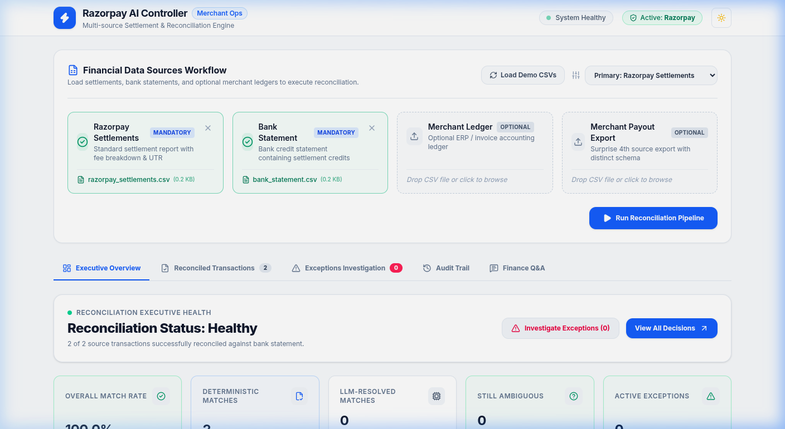
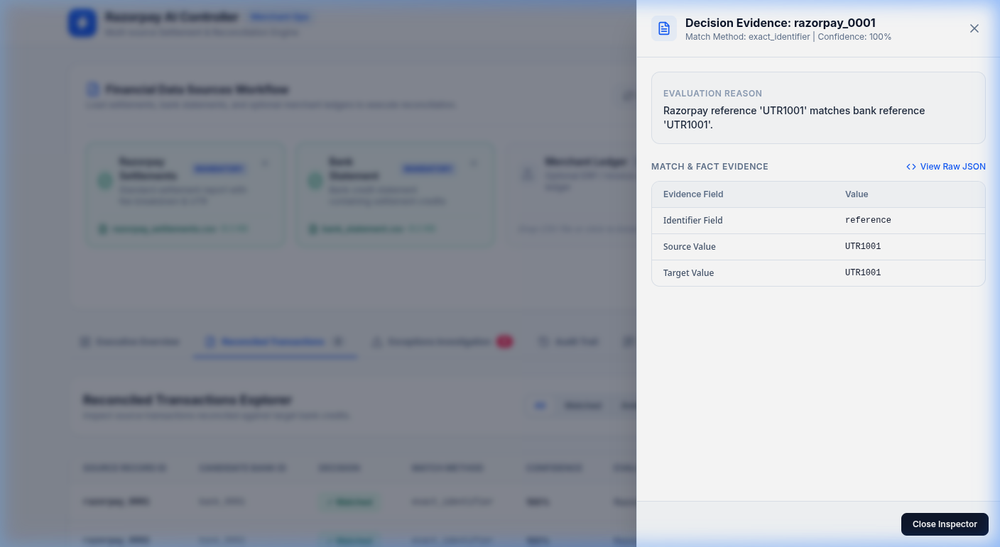
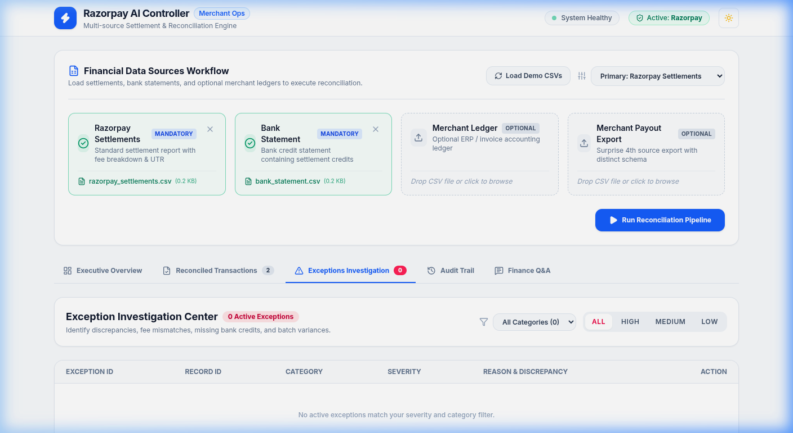
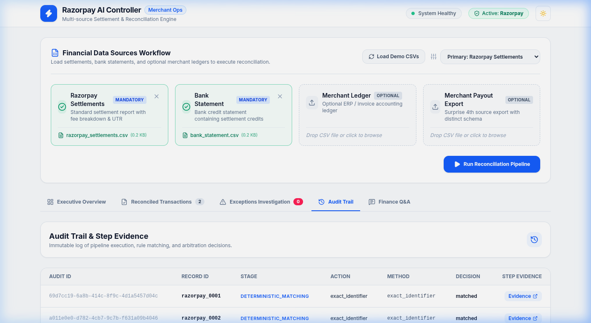
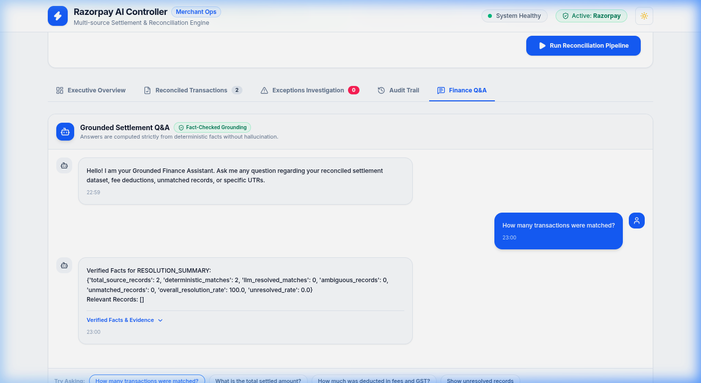

<p align="center">
  
  
  
  
  
</p>

# Razorpay AI Finance Controller

> A deterministic-first, LLM-bounded settlement reconciliation engine with a professional React dashboard.

Matches Razorpay settlement exports against bank statements — and optionally merchant ledger and payout exports — using a six-method deterministic engine. Every decision is evidence-backed and fully auditable. An optional LLM arbitration layer resolves genuinely ambiguous records; its output is validated by a Pydantic contract before any decision is accepted.

---

## The Problem

Finance teams reconciling Razorpay settlements manually face:

- **Schema heterogeneity** — Razorpay, bank statements, merchant ledgers, and payout exports all use different column names, date formats, and amount conventions.
- **Scale** — Hundreds of settlements per cycle; manual matching is error-prone and slow.
- **Auditability** — Spreadsheet-based matching leaves no traceable decision record.
- **LLM risk** — Blindly delegating reconciliation decisions to an LLM introduces hallucination risk in a high-stakes financial domain.

---

## The Solution

```
Raw CSVs → Schema Mapping → Normalisation → Deterministic Matching (6 rules)
                ↓ Ambiguous only ↓
          LLM Arbitration (optional, Pydantic-validated)
                ↓
      Report · Q&A · React Dashboard
```

**Key insight:** LLMs are used where they add value — understanding CSV schemas and, optionally, resolving records that no deterministic rule could distinguish — and nowhere else. Every number shown in the dashboard is computed from deterministic record-level evidence.

---

## Key Features

| Feature | Details |
|---|---|
| **6-method deterministic matcher** | Exact identifier, exact amount+date, financial reconciliation, amount+date tolerance, batch reconciliation, refund detection |
| **LLM arbitration (opt-in)** | Only ambiguous records escalate; provider output validated via `LLMArbitrationDecision` Pydantic model before acceptance |
| **Grounded Q&A** | Answers computed from verified fact sets; hallucination check on numbers and record IDs |
| **Four-source support** | Razorpay, Bank, Merchant Ledger, Merchant Payout Export — all through the same canonical pipeline |
| **Full audit trail** | Every decision has a corresponding `AuditRecord` (stage, method, evidence) |
| **Exception tracking** | 9 exception categories, high/medium/low severity, structured evidence |
| **React dashboard** | 5 views: Overview · Decisions Explorer · Exceptions Investigation · Audit Trail · Finance Q&A |
| **160 backend tests** | Zero failures across M0–M9, covering all matching rules, arbitration, report, Q&A, and API |

---

## Current Results (Razorpay Settlements + Bank Statement dataset)

| Metric | Value |
|---|---|
| Source records | 81 Razorpay settlements |
| **Deterministic matches** | **65 (80.2%)** |
| LLM-resolved | 0 *(mock provider; real LLM interface is ready)* |
| Still ambiguous | 13 |
| Unmatched | 3 |
| **Overall resolution rate** | **80.2%** |
| Total exceptions | 16 |
| High severity | 6 (3 duplicate · 3 missing_record) |
| Medium severity | 10 (10 ambiguous_match) |

**Matching method breakdown (deterministic):**

| Method | Count | Confidence |
|---|---|---|
| `exact_identifier` | 41 | 1.00 |
| `batch_amount_reconciliation` | 9 | 0.90 |
| `exact_amount_date` | 11 | 0.95 |
| `amount_date_tolerance` | 2 | 0.85 |
| `refund_identifier` | 2 | 0.95 |

---

## Architecture

See [ARCHITECTURE.md](./ARCHITECTURE.md) for the full Mermaid diagram and per-service description.

### Deterministic Match Engine — 6 Methods

The engine runs a **batch pre-pass** before processing records individually:

| Order | Method | Rule |
|---|---|---|
| Pre-pass | `batch_amount_reconciliation` | ≥2 Razorpay records share a UTR; their settled amount sum equals one bank credit |
| 1 | `exact_identifier` | UTR / settlement reference exact string match (normalised: case-insensitive, prefix-stripped) · conf 1.00 |
| 2 | `exact_amount_date` | amount equal AND `settlement_date == posted_date` · conf 0.95 |
| 3 | `financial_reconciliation` | `gross − fee − tax == bank_credit` on same date · conf 0.92 |
| 4 | `amount_date_tolerance` | amount equal AND \|date diff\| ≤ 3 days · conf 0.85 |
| 5 | `refund_identifier` | `settlement_id` starts with `ref_`; matched to bank debit of same gross amount · conf 0.95 |
| Fallback | `ambiguous` / `duplicate` / `unmatched` | Multiple candidates → ambiguous · Duplicate identifiers → duplicate exception · No match → unmatched |

Each matched record consumes its bank counterpart from the available pool, preventing double-matching.

### LLM's Bounded Role

The LLM is involved in **two places only:**

1. **Schema Mapper** — reads uploaded CSV column headers and returns a `FieldMapping` dictionary. It makes no reconciliation decisions.
2. **Arbitration (opt-in)** — receives only records that left the deterministic engine as `ambiguous`. The provider's output must:
   - Pass `LLMArbitrationDecision` Pydantic validation
   - Return a candidate ID that exists in the original candidate pool (hallucinated IDs are rejected)
   - If either check fails, the original `ambiguous` decision is preserved

### Grounded Q&A

```
Question → QuestionInterpreter (regex/keyword, no LLM)
         → DeterministicRetriever (exact record lookup)
         → FactComputer (verified GroundedFactSet)
         → AnswerGenerator (hallucination check → grounded answer)
```

The hallucination check verifies: every number > 100 or with decimals must appear in `fact_set.numerical_values`; every record ID pattern must appear in `fact_set.record_ids`. Fails → deterministic fallback answer returned instead.

### Fourth-Source Support

The Merchant Payout Export uses a completely different column schema (`Payout No`, `Gross Sales`, `Processing Charges`, `Payout Channel`, etc.). It enters the pipeline through the Schema Mapper like any other source and immediately benefits from the full downstream deterministic engine — no pipeline changes needed.

---

## Screenshots

### Executive Overview


### Decisions Explorer (Evidence Drawer open)


### Exceptions Investigation Center


### Audit Trail


### Grounded Finance Q&A


---

## Tech Stack

**Backend**
- Python 3.14
- [FastAPI](https://fastapi.tiangolo.com/) 0.141 — API adapter
- [Pydantic](https://docs.pydantic.dev/) v2 — all data models and LLM output validation
- [Uvicorn](https://www.uvicorn.org/) — ASGI server
- [Streamlit](https://streamlit.io/) — retained as fallback UI

**Frontend**
- [React](https://react.dev/) 18 + [TypeScript](https://www.typescriptlang.org/)
- [Vite](https://vitejs.dev/) 8
- [Tailwind CSS](https://tailwindcss.com/) v4
- [Recharts](https://recharts.org/) — matching method bar chart
- [Lucide React](https://lucide.dev/) — icons

**Testing**
- [pytest](https://pytest.org/) 9.1 · 160 tests · 0 failures

---

## Setup & Run

### Prerequisites

- Python 3.14
- Node.js 18+

### 1. Clone & create virtualenv

```bash
git clone <repo-url>
cd razorpay-finance-controller
python -m venv fin_env
source fin_env/bin/activate          # Windows: fin_env\Scripts\activate
pip install -r requirements.txt
```

### 2. Generate synthetic dataset

```bash
python scripts/generate_data.py
# Writes: data/raw/razorpay_settlements.csv
#         data/raw/bank_statement.csv
#         data/raw/merchant_ledger.csv
#         data/raw/fourth_source.csv
```

### 3. Start the FastAPI backend

```bash
PYTHONPATH=. uvicorn app.api_app:app --reload --port 8000
# Health check: http://localhost:8000/api/health
```

### 4. Start the React frontend

```bash
cd frontend
npm install
npm run dev
# Opens: http://localhost:5173
```

### 5. (Optional) Streamlit fallback UI

```bash
PYTHONPATH=. streamlit run streamlit_app.py
```

---

## Testing

```bash
source fin_env/bin/activate
PYTHONPATH=. pytest tests/ -v
```

**Test suite coverage (160 tests):**

| File | Milestone | What it covers |
|---|---|---|
| `test_models.py` | M1 | `CanonicalTransaction`, `ReconciliationDecision`, `ExceptionRecord`, `AuditRecord` |
| `test_schema_mapper.py` | M2 | Schema mapping, `MockLLMProvider` |
| `test_normalizer.py` | M2 | Date/amount normalisation, source tagging |
| `test_matcher.py` | M3 | All 6 deterministic rules, edge cases, batch/refund/duplicate detection |
| `test_report.py` | M6 | Metric correctness, no double-counting, traceability, read-only behaviour |
| `test_arbitrator.py` | M4/M5 | LLM output validation, hallucinated candidate ID rejection, ambiguous preservation |
| `test_qa.py` | M7 | All 9 Q&A intents, grounding, hallucination check |
| `test_audit_exception_hardening.py` | M8 | Exception categories, audit completeness, deduplication |
| `test_fourth_source.py` | M9 | Full pipeline with fourth-source CSV |
| `test_ui.py` | M9 | `run_pipeline()` orchestration, optional source contract |
| `test_api.py` | M9 | FastAPI endpoints, session management |
| `test_data_generator.py` | M0 | Synthetic data generation |

---

## Project Structure

```
razorpay-finance-controller/
├── app/
│   ├── api_app.py              # FastAPI adapter (3 endpoints)
│   ├── ui_app.py               # Streamlit fallback UI + run_pipeline()
│   ├── models/
│   │   ├── canonical.py        # CanonicalTransaction, ReconciliationDecision, ExceptionRecord, AuditRecord
│   │   ├── arbitration.py      # LLMArbitrationDecision (Pydantic validation gate)
│   │   ├── mapping.py          # FieldMapping
│   │   └── qa.py               # ParsedCommand, GroundedFactSet, GroundedAnswer
│   └── services/
│       ├── matcher.py          # DeterministicMatcher — 6 matching methods
│       ├── normalizer.py       # Raw rows → CanonicalTransaction
│       ├── schema_mapper.py    # CSV column headers → FieldMapping (LLM-assisted)
│       ├── arbitrator.py       # LLMArbitrationService — bounded LLM escalation
│       ├── reconciliation.py   # reconcile() — orchestrates matcher + arbitrator
│       ├── report.py           # generate_reconciliation_report() — read-only metrics
│       └── qa.py               # FinanceQA — grounded Q&A pipeline
├── frontend/
│   ├── src/
│   │   ├── App.tsx             # Upload workflow + tab routing
│   │   ├── pages/              # 5 views: Overview, Decisions, Exceptions, Audit, QA
│   │   ├── components/         # Navbar, MetricCard, SourceCard, StatusBadge, EvidenceDrawer
│   │   ├── services/api.ts     # Typed API client
│   │   └── types/index.ts      # TypeScript types mirroring backend models
│   └── vite.config.ts
├── tests/                      # 12 test files, 160 tests
├── scripts/generate_data.py    # Synthetic dataset generator
├── data/raw/                   # Generated CSV files
├── docs/screenshots/           # Dashboard screenshots (light theme)
├── ARCHITECTURE.md             # Full architecture diagram + service descriptions
├── DEMO.md                     # 2-3 minute judge demo script
└── requirements.txt            # Pinned Python dependencies
```

---

## Design Decisions

### Why deterministic-first?

Financial reconciliation has a clear, rule-based structure: UTR references are exact identifiers, amounts must balance to the cent, and date tolerances follow Razorpay's settlement scheduling. These constraints can be expressed as deterministic rules with near-perfect precision. Running LLMs against every record would be slower, costlier, and introduce hallucination risk where it isn't needed.

### Why is the LLM bounded?

In the Q&A module, the `AnswerGenerator` checks every number and record ID in the LLM's response against the verified fact set before returning it. In arbitration, the LLM's candidate choice is verified against the original ambiguous candidate pool. This means a misconfigured or hallucinating LLM degrades gracefully to the deterministic fallback rather than producing wrong answers silently.

### Why `CanonicalTransaction`?

Every source — regardless of original schema — is normalised into the same Pydantic model before any matching logic runs. This means the deterministic engine, arbitration, report, and Q&A modules are completely source-agnostic. Adding a new CSV format requires only a new `FieldMapping` from the schema mapper; no downstream code changes.

### Why `reconcile(source, target, arbitrator=None)`?

The reconciliation pipeline is designed to be fully functional without an LLM. Arbitration is a clean, optional parameter. The current deployment passes no arbitrator, producing fully deterministic results. Wiring in a real LLM provider is a one-line change to the caller.

---

## Limitations & Future Work

| Area | Current state | Future |
|---|---|---|
| LLM provider | Mock only (`MockArbitrationProvider`) | Wire in real OpenAI / Gemini provider via `ArbitrationProvider` abstract interface |
| Schema mapping | `MockLLMProvider` (deterministic column heuristics) | Real LLM call for true zero-shot schema inference |
| Q&A | Answers are deterministically formatted fact dumps | Real LLM for fluent answer phrasing, with hallucination check already in place |
| Scale | Single-session, in-memory | Persistent session store (Redis/PostgreSQL) for production |
| Authentication | None | Merchant-level auth + role-based access |
| Multi-period | Single file upload per reconciliation run | Bulk/batch reconciliation across date ranges |
| UI | React dev server proxied to FastAPI | Serve React build from FastAPI for single-process deployment |

---

## Demo

See [DEMO.md](./DEMO.md) for the full 2–3 minute judge demo script covering all five dashboard views.
